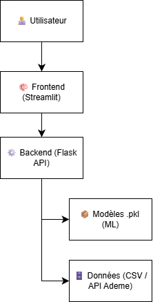

# Documentation technique de l'application

## 1. Architecture de l'application 

L'application est structurée de la façon suivante : 

- Frontend : géré par Streamlit. Framework python. Visualisation de l'application et interaction avec l'utilisateur.

- Backend : géré par Flask. Intermédiaire entre le frontend et les modèles de machines learning (fichiers .pkl).
  
- Modèles : fichiers PKL. Ces fichiers contiennent les modèles de classification et de régression entraînés avec les données de l'Ademe. 

- Données : fichiers CSV ou requête vers l'API de l'Ademe des diagnostics de performances énergétiques.

  

Schéma de l'architecture applicative:

## 2.  Installation de l'application 

### 1. Prérequis logiciels:
- Python 3.11
- GIT 
- VSCode

### 2. Prérequis librairies
Vous trouverez dans le fichier *requirement.txt* les librairies à installer pour lancer l'application. 

Visualisation : 
Plotly : Graphiques interactifs (3D, cartes, dashboards, etc.)
Folium : Création de cartes interactives basées sur Leaflet.js (affichage de points géographiques, itinéraires, etc.).
Seaborn : Visualisation statistique basée sur matplotlib — permet de créer des graphiques esthétiques simplement.

Frameworks web:
Flask : Micro-framework Python pour créer des applications web et des APIs légères.
Flasgger : Extension de Flask permettant d’ajouter facilement une documentation Swagger/OpenAPI pour tester ses endpoints API via une interface web.

Application : 
Streamlit : Framework simple pour créer des applications web interactives.
Streamlit-lottie : Permet d’intégrer des animations Lottie (JSON animés) dans une app Streamlit.

Cartographie :
Streamlit-folium : Intégration de cartes Folium dans des applications Streamlit.
Pyproj : Conversion de coordonnées géographiques et projections cartographiques.

API: 
Requests : Envoie des requêtes HTTP (GET, POST, etc.) à des APIs ou sites web.
Requests-oauthlib :	Gère les authentifications OAuth (utile pour accéder à des APIs protégées).
Urllib3 : Bibliothèque bas niveau pour les connexions HTTP, utilisée en interne par requests.

### 3. Installation
- Faire un clône de l'application via la commande `git clone https://github.com/YassineCHN/SISE_Enedis`
- Bibliothèques: Installer les bibliothèques contenues dans le fichier requirement.txt
  Activer l'environnement qui va servir à lancer l'application, utiliser la commande `pip install -r chemin_absolu\requirements.txt` afin d'importer les librairies dans cet environnement.
    

### 4. Exécution
- Depuis le terminal, lancer l'application via la commande `streamlit run chemin_absolu/app.py`

     
